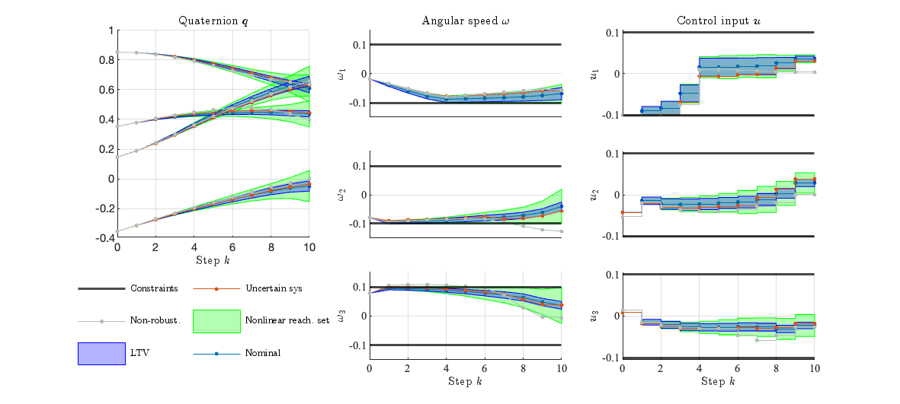

# Robust Nonlinear Optimal Control via System Level Synthesis.
This repository contains the MATLAB code that accompanies the research paper:
> Leeman AP., Köhler J., Zanelli A., Bennani S., Zeilinger MN. “Robust Nonlinear Optimal Control via System Level Synthesis” 
> Arxiv preprint: arXiv:2301.04943



The paper is under revision and is freely available on [arXiv](https://arxiv.org/abs/2301.04943).

## Prerequisites
- MATLAB (tested with version R2023b) on Macbook Pro (M1 Processor)
- CasADi (tested with casadi-3.6.4-osx_arm64-matlab2018b)

## Installation
1. Download and install MATLAB from the [official website](https://www.mathworks.com/products/matlab.html).

2. Install Casadi by following the instructions from the [official Casadi documentation](https://web.casadi.org/get/).
    
3. Clone this repository or download the code as a ZIP archive and extract it to a folder of your choice.

4. Add the code folder to your MATLAB path by running the following command in the MATLAB Command Window:
    
        addpath('/path/to/your/code/folder');
    
## Usage

Run the main script (i.e., main.m) to execute the algorithms discussed in the paper.

## License

This project is licensed under the MIT License.

## Citation

If you use this code in your research, please cite our paper:
  ```
@article{leeman2023robust,
  title={Robust nonlinear optimal control via system level synthesis},
  author={Leeman, Antoine P and K{\"o}hler, Johannes and Zanelli, Andrea and Bennani, Samir and Zeilinger, Melanie N},
  journal={arXiv preprint arXiv:2301.04943},
  year={2023}
}

  ```
  

## Support and Contact

For any questions or issues related to this code, please contact the author:

- Antoine Leeman: aleeman(at)ethz(dot)ch

We appreciate any feedback, bug reports, or suggestions for improvements.
